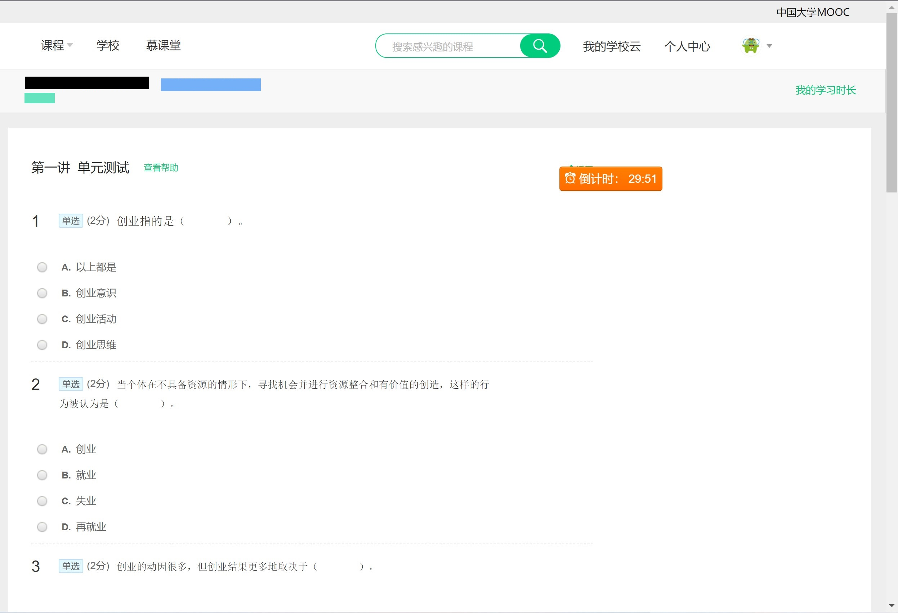

# OnlineCourseSearchQues
## 适用于“中国大学MOOC”的《大学生创新创业》课程题目查找。下载后按提示自行选择操作方式即可
欢迎测试别的学科，并提出建议
才疏学浅，小程序难免有bug，请不吝指正
## 全页搜索使用方法：
* 由于考试过程中直接访问考试页面会被重定向到课程主页，无法获取到内容，所以需要将网页保存到本地进行解析。
* 保存网页到本地，请选择“网页，完成”模式保存到本地。

* 进入运行环境（此处为Pycharm），运行，依次选择整页搜题并粘贴路径
* 根据保存的页面选择页面类型，请保证选择正确，否则无法获取到题目

**当保存的页面如下所示，为考试后的分析页面时，请选择“分析页面”**
**当保存的页面如下所示，为考试中保存的页面时，请选择“考试页面”**
* 随后只要等待搜索完成即可。
## 新增打包好的exe可执行文件
* 下载地址：[《中国大学MOOC》搜题工具](dist/《中国大学MOOC》搜题工具.exe)，下载完即可使用，使用方式和上述相同